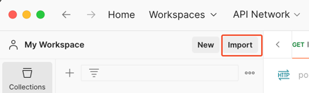
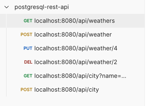

# Spring Boot JPA PostgreSQL example with Maven

## Initial Table
use [test.sql](./test.sql) to create the initial table.
```bash
mydb=> \i test.sql
```

## Import Postman Collection


Import [postgresql-rest-api.json](./postgresql-rest-api.json) to Postman.


